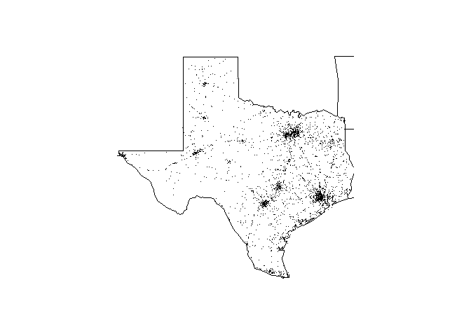

# FARSpckgwk4
Building R Packages - final Project Coursera

[](https://travis-ci.org/ykv001/FARSpckgwk4)

[](https://ci.appveyor.com/project/ykv001/FARSpckgwk4)

This packages contains functions that summarize and maps Vehicle fatalities in 
the USA from the US National Highway Traffic Safety Administration's Fatality 
Analysis Reporting System (FARS)

## Installation
        
        devtools::install_github(FARSpckgwk4)

Use data from to test [fars_data.zip](https://d3c33hcgiwev3.cloudfront.net/_e1adac2a5f05192dc8780f3944feec13_fars_data.zip?Expires=1493769600&Signature=gEcqRcF1G5yAFIxpwXtsBBbt4OP12lj2yYPBBy2QMVJFcnWKc5rudxbhUTBzsAZWUimlOj4yBskmcRquZ-7cYsgDhsEJTeM8fSfzGNFcLQLDxL0KEgK~I2tCSNxfHGa5r1Ai27cig-rEMoNCuaAuQuSkmfjxwNPjkPir3I-f6gc_&Key-Pair-Id=APKAJLTNE6QMUY6HBC5A)
        
## Use examples


```r
library(maps)
library(FARSpckgwk4)
make_filename(2013)
```

```
## [1] "accident_2013.csv.bz2"
```

```r
make_filename(2014)
```

```
## [1] "accident_2014.csv.bz2"
```

```r
make_filename(2015)
```

```
## [1] "accident_2015.csv.bz2"
```

```r
fars_read("accident_2013.csv.bz2")
```

```
## # A tibble: 30,202 × 50
##    STATE ST_CASE VE_TOTAL VE_FORMS PVH_INVL  PEDS PERNOTMVIT PERMVIT
##    <int>   <int>    <int>    <int>    <int> <int>      <int>   <int>
## 1      1   10001        1        1        0     0          0       8
## 2      1   10002        2        2        0     0          0       2
## 3      1   10003        1        1        0     0          0       1
## 4      1   10004        1        1        0     0          0       3
## 5      1   10005        2        2        0     0          0       3
## 6      1   10006        2        2        0     0          0       3
## 7      1   10007        1        1        0     0          0       1
## 8      1   10008        2        2        0     0          0       2
## 9      1   10009        1        1        0     0          0       1
## 10     1   10010        2        2        0     0          0       4
## # ... with 30,192 more rows, and 42 more variables: PERSONS <int>,
## #   COUNTY <int>, CITY <int>, DAY <int>, MONTH <int>, YEAR <int>,
## #   DAY_WEEK <int>, HOUR <int>, MINUTE <int>, NHS <int>, ROAD_FNC <int>,
## #   ROUTE <int>, TWAY_ID <chr>, TWAY_ID2 <chr>, MILEPT <int>,
## #   LATITUDE <dbl>, LONGITUD <dbl>, SP_JUR <int>, HARM_EV <int>,
## #   MAN_COLL <int>, RELJCT1 <int>, RELJCT2 <int>, TYP_INT <int>,
## #   WRK_ZONE <int>, REL_ROAD <int>, LGT_COND <int>, WEATHER1 <int>,
## #   WEATHER2 <int>, WEATHER <int>, SCH_BUS <int>, RAIL <chr>,
## #   NOT_HOUR <int>, NOT_MIN <int>, ARR_HOUR <int>, ARR_MIN <int>,
## #   HOSP_HR <int>, HOSP_MN <int>, CF1 <int>, CF2 <int>, CF3 <int>,
## #   FATALS <int>, DRUNK_DR <int>
```

```r
fars_read_years(c(2013,2014,2015))
```

```
## [[1]]
## # A tibble: 30,202 × 2
##    MONTH  year
##    <int> <dbl>
## 1      1  2013
## 2      1  2013
## 3      1  2013
## 4      1  2013
## 5      1  2013
## 6      1  2013
## 7      1  2013
## 8      1  2013
## 9      1  2013
## 10     1  2013
## # ... with 30,192 more rows
## 
## [[2]]
## # A tibble: 30,056 × 2
##    MONTH  year
##    <int> <dbl>
## 1      1  2014
## 2      1  2014
## 3      1  2014
## 4      1  2014
## 5      1  2014
## 6      1  2014
## 7      1  2014
## 8      1  2014
## 9      1  2014
## 10     1  2014
## # ... with 30,046 more rows
## 
## [[3]]
## # A tibble: 32,166 × 2
##    MONTH  year
##    <int> <dbl>
## 1      1  2015
## 2      1  2015
## 3      1  2015
## 4      1  2015
## 5      1  2015
## 6      1  2015
## 7      1  2015
## 8      1  2015
## 9      1  2015
## 10     1  2015
## # ... with 32,156 more rows
```

```r
fars_map_state(48,2013)
```

```
## Warning: package 'bindrcpp' was built under R version 3.3.3
```

<!-- -->
